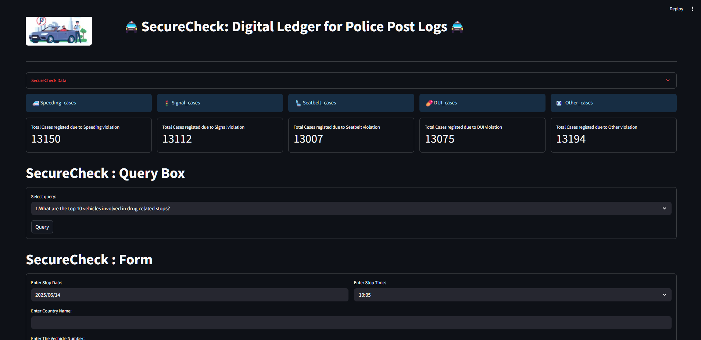

# 🚔 SecureCheck: A Python-SQL Digital Ledger for Police Post Logs

SecureCheck is a Streamlit-powered dashboard that visualizes and analyzes traffic stop data collected from law enforcement activities. It integrates data ingestion, processing with Pandas, storage in MySQL, and querying capabilities for insights and trend analysis.

---

## 📁 Project Structure

```
SecureCheck/
│
├── main.py                      # Extracts, cleans, and stores traffic data from a Google Sheet into MySQL
├── app.py                       # Streamlit dashboard for data display, query interface, and manual entry
├── requirements.txt             # Required Python packages
└── README_SecureCheck.md        # Project documentation
```

---

## ⚙️ Step-by-Step Setup

### 1. 🔧 Create a Virtual Environment in VS Code

Open your terminal and run:

```bash
python -m venv venv
```

Activate the environment:

- **Windows:**
  ```bash
  venv\Scripts\activate
  ```

- **Mac/Linux:**
  ```bash
  source venv/bin/activate
  ```

### 2. 📦 Install Required Packages

Create a `requirements.txt` file with the following:

```txt
pandas
mysql-connector-python
pymysql
SQLAlchemy
streamlit
```

Install them:

```bash
pip install -r requirements.txt
```

---

## 🗃️ Database Setup

Ensure you have MySQL installed and running on your local machine.

- **MySQL Credentials Used:**

  - Host: `127.0.0.1`
  - User: `root`
  - Password: `admin`
  - Database: `police_secure_check` (auto-created by main.py)

---

## 🧮 Step 1: Run `main.py` to Ingest and Store Data

This script does the following:

- Connects to a Google Sheet using the public CSV link
- Cleans and preprocesses the dataset
- Merges `stop_date` and `stop_time` into a single datetime field
- Drops unnecessary columns
- Stores the cleaned data in a new MySQL database table: `traffic_stop_police`

### 🔄 Run

```bash
python main.py
```

✅ You should see: `Data added successfully`

---

## 📊 Step 2: Run Streamlit App (`app.py`)

This Streamlit dashboard includes:

- 📁 **Home View** – Explore traffic stop data by selecting specific columns
- 🧠 **Query Interface** – Predefined SQL queries for pattern and trend discovery
- 📝 **Form** – Manual entry interface for inserting new data into the database

### ▶️ Run the app:

```bash
streamlit run app.py
```

Your browser will open at `http://localhost:8501/` with the dashboard UI.

---

## 🔍 Predefined SQL Queries Supported

Examples include:

- Top 10 vehicles in drug-related stops
- Gender and race-based search statistics
- Hourly breakdown of stops
- Age-based arrest trends
- Country-wise violations and arrest rates

---

## 📥 Manual Entry Feature

- Submit new stop data through a user-friendly form
- Summary generated in natural language
- Data saved directly to the MySQL database

---

## 🖼️ Dashboard Screenshot (Optional)



---

## 🧑‍💻 Author

**Arunprakash Babu**  
Currently pursuing Data Science at GUVI  
Project: SecureCheck — GUVI Capstone Project
